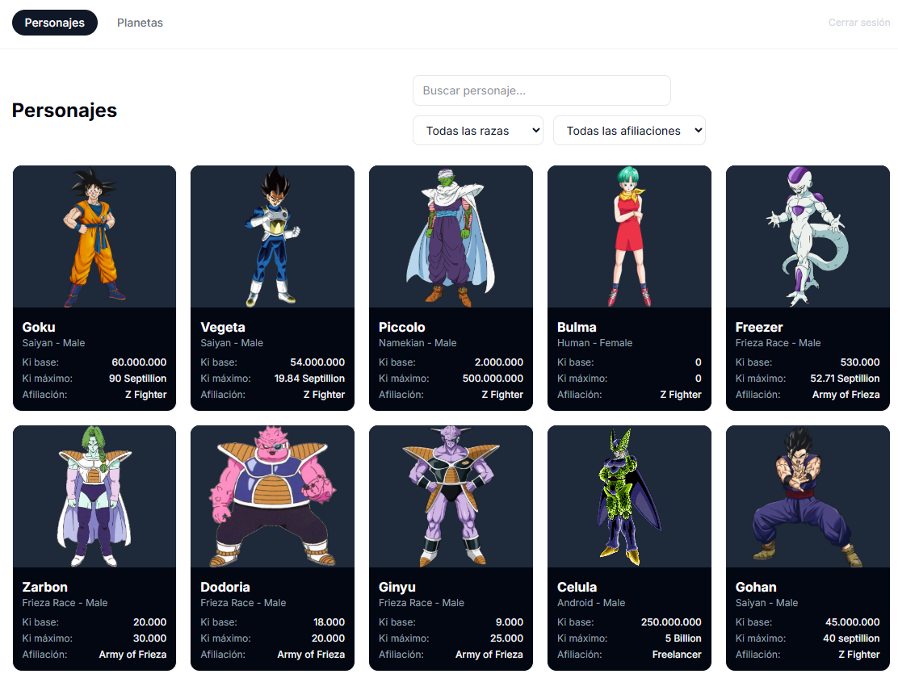
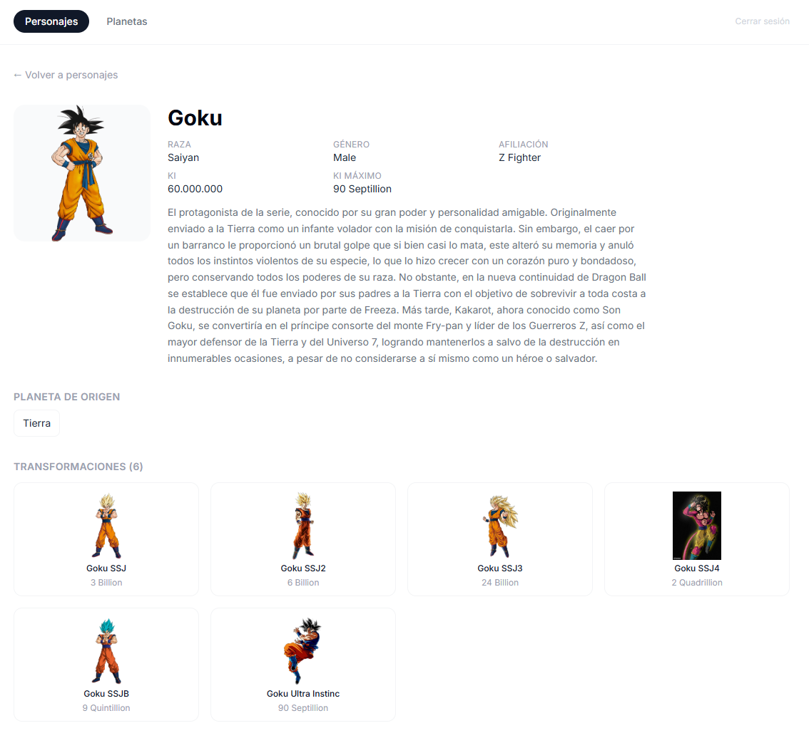

# Explorador Dragon Ball

Aplicación **Fabric App** construida con **React 19 + Vite + TypeScript** y autenticada con **Rayfin** (el SDK de Microsoft Fabric para aplicaciones). Permite explorar los personajes y planetas de la [Dragon Ball API](https://web.dragonball-api.com/documentation): buscar, filtrar, abrir las transformaciones de un personaje y navegar entre un personaje y su planeta de origen.

La interfaz está en español y todo el catálogo se consume directamente desde el navegador contra `https://dragonball-api.com/api`, sin backend propio. La autenticación, en cambio, está gestionada por Rayfin/Fabric.

---

## Capturas

### Catálogo de personajes



### Detalle de personaje y transformaciones



---

## ¿Qué es una Fabric App?

Una **Fabric App** es una aplicación que se despliega y opera dentro de **Microsoft Fabric**. No es un servidor tradicional: Fabric se encarga del hosting estático, de la autenticación contra Entra ID (Azure AD) y, opcionalmente, de una capa de datos y funciones serverless.

En este proyecto, **Rayfin** es el SDK y CLI que conecta la app con Fabric. `rayfin.yml` define qué servicios de Fabric se activan:

| Servicio | Estado | Descripción |
|----------|--------|-------------|
| **Auth** | ✅ Activado | Autenticación gestionada por Fabric (Entra ID) en producción; usuario/contraseña local en desarrollo |
| **Static Hosting** | ✅ Activado | Fabric sirve el bundle de Vite (`dist/`) como contenido estático |
| **Data** | ❌ Desactivado | Sin capa de datos Rayfin — el catálogo vive en la Dragon Ball API externa |
| **Storage** | ❌ Desactivado | Sin almacenamiento en OneLake |
| **Functions** | ❌ Desactivado | Sin Functions serverless |

El `manifest.json` declara los tokens (`__RAYFIN_API_URL__`, `__RAYFIN_PK__`, `__FABRIC_ITEM_ID__`, `__FABRIC_WORKSPACE_ID__`, `__FABRIC_PORTAL_URL__`) que Rayfin rellena automáticamente al aprovisionar o desplegar la app en Fabric.

---

## Arquitectura

```
Browser  ──►  React + Vite (SPA)
  │
  ├─► Rayfin Client (auth)  ──►  Fabric / Entra ID  (autenticación)
  │
  └─► fetch() directo a https://dragonball-api.com/api  (catálogo: personajes, planetas, transformaciones)
```

### Autenticación dual

El archivo `src/services/bootstrap.ts` decide en tiempo de ejecución qué servicio de auth usar:

- **Localhost** (`http://localhost:5168`) → `MockAuthService`: usa un usuario de desarrollo fijo (`dev@contoso.com`) contra el backend local de Rayfin. No requiere Fabric/Entra.
- **Remoto** (cualquier otra URL) → `RayfinAuthService`: utiliza `@microsoft/rayfin-auth-provider-fabric` para el flujo de autenticación brokered por Fabric (popup de Entra ID, sesión embebida en iframe, etc.).

Ambos implementan la interfaz `IAuthService`, por lo que el resto de la app no sabe qué backend hay debajo.

### Catálogo Dragon Ball

`src/services/dragonball/dragonballApi.ts` es un cliente fetch con clasificación de errores (timeout, red, HTTP). El contexto `DragonBallCatalogContext` carga y cachea personajes y planetas una sola vez por sesión; las páginas de detalle consumen el mismo caché y sólo hacen peticiones de detalle individual.

### Estados de vista

Cada página (lista o detalle) se resuelve siempre a uno de tres estados: `LoadingState`, `ErrorState` (con reintento) o `EmptyState`, además del contenido cuando hay datos. La API externa no tiene SLA ni rate-limit documentado, por lo que el manejo de errores es explícito en toda la app.

---

## Estructura del proyecto

```text
├── rayfin/
│   ├── rayfin.yml                        # Configuración de servicios Fabric (auth + static hosting)
│   ├── tsconfig.json
│   └── data/
│       └── schema.ts                     # Esquema Rayfin (vacío: sin capa de datos)
├── public/                               # Recursos estáticos
├── src/
│   ├── main.tsx                          # Entry point + bootstrap del cliente Rayfin
│   ├── App.tsx                           # Rutas (React Router) y auth gate
│   ├── main.css                          # Estilosglobales + Tailwind CSS v4
│   ├── hooks/
│   │   ├── AuthContext.tsx               # Context de React para auth
│   │   └── DragonBallCatalogContext.tsx   # Carga y cachea el catálogo una vez
│   ├── components/
│   │   ├── AuthPage.tsx                  # UI de sign-in
│   │   ├── AppShell.tsx                  # Layout: nav + catalog provider
│   │   ├── CatalogNav.tsx                # Navegación Personajes/Planetas + sign out
│   │   ├── CharacterCard.tsx             # Tarjeta de personaje en grid
│   │   ├── PlanetCard.tsx                # Tarjeta de planeta en grid
│   │   ├── CharacterFilters.tsx          # Filtros por género/edad
│   │   ├── SearchInput.tsx               # Búsqueda libre
│   │   ├── TransformationList.tsx        # Lista de transformaciones de un personaje
│   │   ├── DetailField.tsx               # Campo individual en vista de detalle
│   │   ├── LoadingState.tsx              # Estado de carga
│   │   ├── ErrorState.tsx                # Estado de error con reintento
│   │   └── EmptyState.tsx                # Estado vacío
│   ├── pages/
│   │   ├── CharactersPage.tsx            # Listado de personajes
│   │   ├── CharacterDetailPage.tsx       # Detalle de personaje + transformaciones
│   │   ├── PlanetsPage.tsx               # Listado de planetas
│   │   ├── PlanetDetailPage.tsx          # Detalle de planeta
│   │   └── TransformationDetailPage.tsx  # Detalle de transformación
│   ├── services/
│   │   ├── dragonball/
│   │   │   ├── dragonballApi.ts          # Cliente fetch con clasificación de errores
│   │   │   └── types.ts                  # Tipos Character/Planet/Transformation
│   │   ├── IAuthService.ts               # Interfaz de auth + tipo AuthUser
│   │   ├── MockAuthService.ts            # Auth local-dev (email/password)
│   │   ├── RayfinAuthService.ts          # Auth producción (Fabric brokered)
│   │   ├── rayfinClient.ts               # Singleton tipado de RayfinClient
│   │   └── bootstrap.ts                  # Lee variables y elige el auth service
│   └── utils/
│       ├── normalizeText.ts              # Búsqueda insensible a mayúsculas y acentos
│       └── uniqueSorted.ts              # Deriva opciones de filtro desde los datos
├── manifest.json                         # Declaración de servicios y tokens Fabric
├── package.json
├── tsconfig.json
├── vite.config.ts                        # Vite + plugin Rayfin local-dev + Tailwind
├── vitest.config.ts
├── eslint.config.js
└── index.html
```

---

## Stack técnico

| Capa | Herramienta | Versión |
|------|-------------|---------|
| Framework UI | React | 19 |
| Bundler / dev server | Vite | 7 |
| Lenguaje | TypeScript | 5.8 |
| Routing | React Router DOM | 7 |
| Estilos | Tailwind CSS | 4 |
| Testing | Vitest + Testing Library | — |
| Linting | ESLint | 9 |
| SDK Fabric | @microsoft/rayfin-* | 1.35 |
| Auth Fabric | @microsoft/rayfin-auth-provider-fabric | 1.35 |

---

## Puesta a cero desde un repositorio compartido

Si recibes este repositorio por primera vez (clonado o descomprimido), sigue estos pasos:

### 1. Requisitos previos

- **Node.js** 20+ y **npm** 10+
- **CLI de Rayfin** — se instala automáticamente con las dependencias del proyecto (no hace que la instales globalmente); todos los scripts usan `npx rayfin` a través de `npm run`.
- Acceso a un **workspace de Microsoft Fabric** donde tengas permisos para crear/aprovisionar aplicaciones.

### 2. Instalar dependencias

```bash
npm install
```

Esto instala React, Vite, Tailwind, el SDK de Rayfin (`@microsoft/rayfin-client`, `@microsoft/rayfin-core`, `@microsoft/rayfin-auth-provider-fabric`, `@microsoft/rayfin-local-dev`) y todas las dependencias de desarrollo.

### 3. Aprovisionar el backend de Fabric y generar variables de entorno

```bash
npm run dev
```

Este comando ejecuta `rayfin dev`, que:

1. Lee `rayfin/rayfin.yml` y `manifest.json` para saber qué servicios activar.
2. Si no existe aún, **crea la aplicación en tu workspace de Fabric** (auth + static hosting).
3. **Genera el archivo `.env.local`** con todas las variables necesarias (`VITE_RAYFIN_API_URL`, `VITE_RAYFIN_PUBLISHABLE_KEY`, `VITE_FABRIC_*`, etc.) y el puerto del dev server (por defecto `5173`).
4. Levanta el **dev server de Vite** con el plugin de Rayfin local-dev activado.

La primera vez tarda más porque aprovisiona recursos en Fabric. En ejecuciones posteriores reutiliza el backend existente.

> **Alternativa:** Si ya tienes el backend aprovisionado y sólo quieres el frontend:
> ```bash
> npm run dev:frontend
> ```

### 4. Abrir la aplicación

Abre [http://localhost:5173](http://localhost:5173) en el navegador. Verás la pantalla de sign-in. En modo local-dev, el botón de inicio de sesión usa el usuario de desarrollo sin necesidad de Fabric/Entra.

### 5. Variables de entorno

El archivo `.env.local` se genera automáticamente con `rayfin dev` y **no debe crearse a mano**. Si se borra o se corrompe, basta con volver a ejecutar `rayfin dev` (o `rayfin env --framework vite`).

Las variables relevantes son:

| Variable | Origen | Descripción |
|----------|--------|-------------|
| `VITE_RAYFIN_API_URL` | `rayfin dev` | URL del backend de Rayfin (localhost en dev, URL de Fabric en prod) |
| `VITE_RAYFIN_PUBLISHABLE_KEY` | `rayfin dev` | Clave publicable del cliente Rayfin |
| `VITE_FABRIC_WORKSPACE_ID` | Fabric | ID del workspace de Fabric |
| `VITE_FABRIC_ITEM_ID` | Fabric | ID del ítem de la aplicación en Fabric |
| `VITE_FABRIC_PORTAL_URL` | Fabric | URL del portal de Fabric |
| `VITE_PORT` | `rayfin dev` | Puerto del dev server (5173 por defecto) |

### 6. Desplegar en Fabric

```bash
npm run rayfin:up
```

Ejecuta `rayfin:up`, que:

1. Compila el bundle de producción (`npm run build:fabric` → `tsc -b && vite build`).
2. Sube el contenido de `dist/` al static hosting de Fabric.
3. Configura la autenticación de Fabric (Entra ID) para la URL desplegada.

La URL resultante tendrá el formato `https://<nombre>-westeurope.webapp.fabricapps.net`.

---

## Scripts disponibles

| Comando | Descripción |
|---------|-------------|
| `npm run dev` | Aprovisiona (o reutiliza) el backend de Fabric y arranca el dev server local |
| `npm run dev:frontend` | Sólo el dev server de Vite (sin aprovisionar backend) |
| `npm run build` | Build de producción completo (`tsc -b && vite build`) |
| `npm run build:fabric` | Build optimizado para despliegue en Fabric |
| `npm run lint` | Lint con ESLint |
| `npm run test` | Tests unitarios con Vitest |
| `npm run preview` | Preview del build local con `vite preview` |
| `npm run rayfin:up` | Despliega la app a Fabric (sin dev server local) |

---

## Tests

Los tests cubren routing, autenticación, contexto de catálogo, componentes de tarjeta y filtros, y normalización de texto. Los fixtures de la Dragon Ball API están en `src/__tests__/testUtils/dragonballFixtures.ts`.

```bash
npm run test
```

---

## Dependencia externa

El catálogo y las vistas de detalle llaman a `https://dragonball-api.com/api` directamente desde el navegador. Es una API pública sin clave, sin rate-limit documentado y sin garantía de uptime. Si no responde, cada vista muestra un control de reintento en lugar de fallar silenciosamente.
